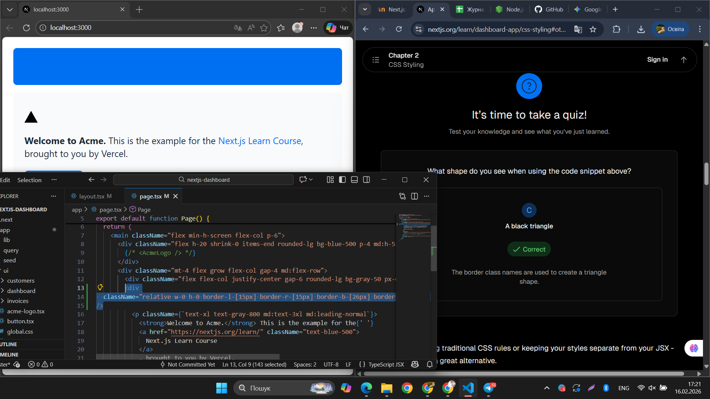
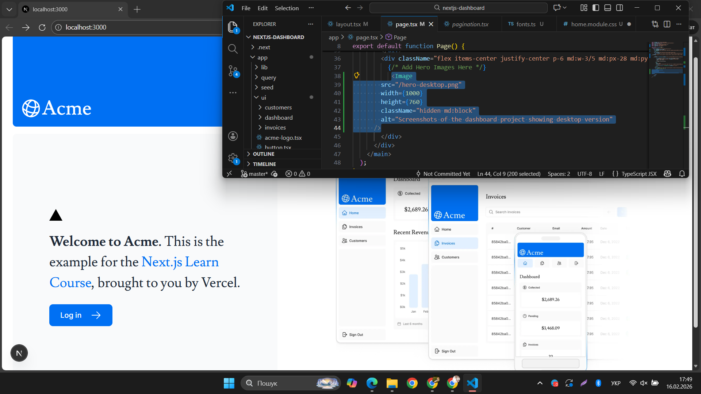
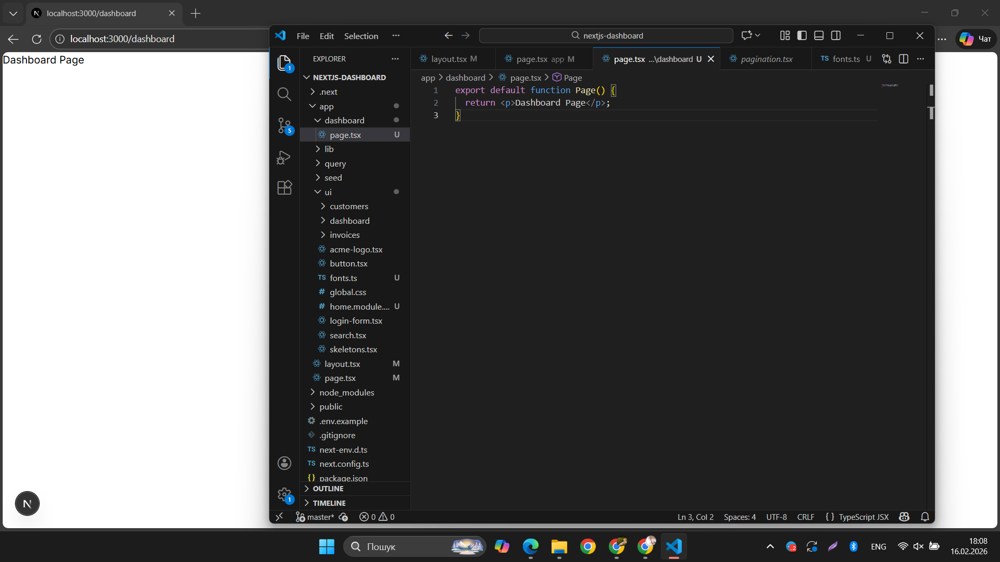
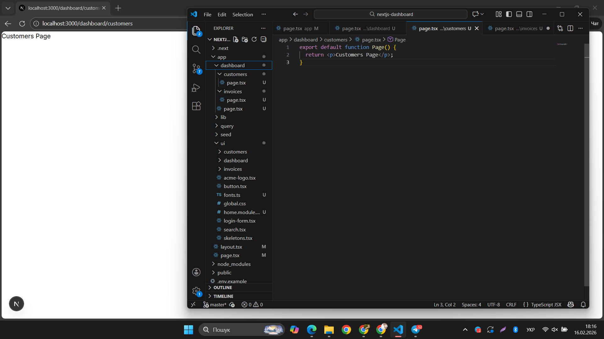
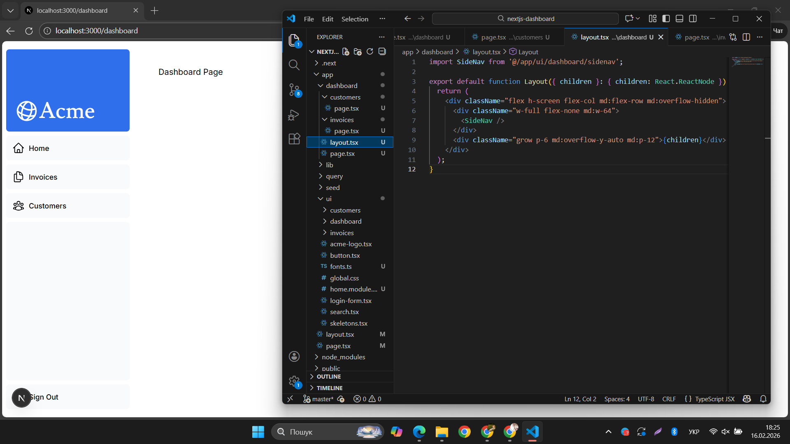
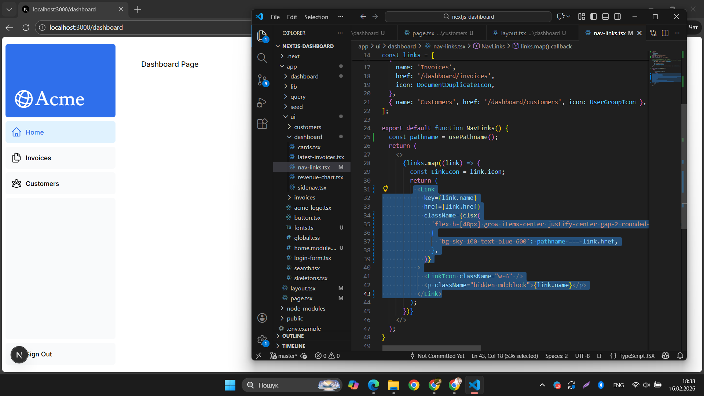
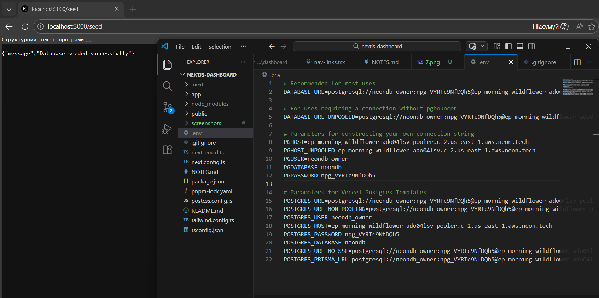
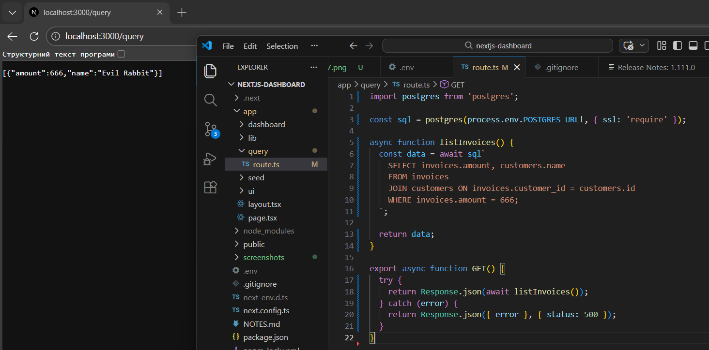
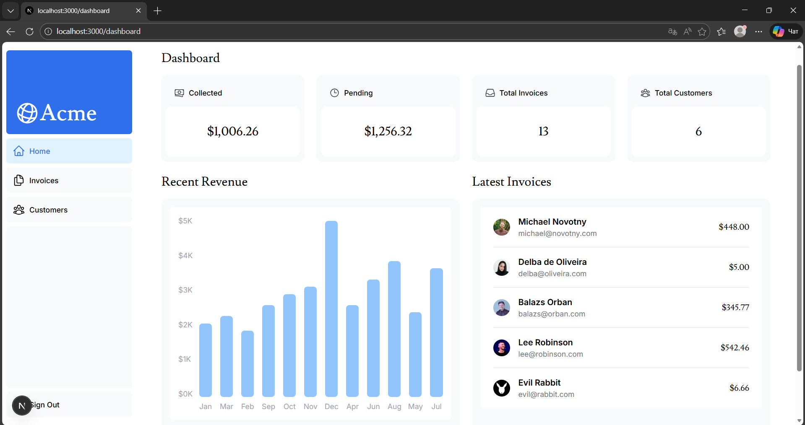

# Звіт з проходження Next.js Tutorial

## Розділ 2-3: CSS-стилізація та оптимізація зображень

**1. Додавання CSS-стилів (Tailwind)**
На цьому етапі було додано стилі за допомогою Tailwind CSS. На скріншоті продемонстровано створення фігури (чорного трикутника) за допомогою утилітарних класів та проходження відповідної вікторини з курсу.

**2. Оптимізація зображень**
Тут використано компонент `<Image>` від Next.js замість звичайного тегу ``. Це дозволяє автоматично оптимізувати розмір зображення та уникнути зсуву макета (Layout Shift) при завантаженні сторінки.

---

## Розділ 4: Створення макетів та сторінок (Routing)

**3. Базова маршрутизація (Сторінка Dashboard)**
Продемонстровано створення нової сторінки за допомогою файлової системи Next.js. Створено папку `dashboard` та файл `page.tsx`, що автоматично згенерувало маршрут `/dashboard`.

**4. Вкладена маршрутизація (Сторінка Customers)**
Створено вкладений маршрут для сторінки клієнтів. Додано файл `page.tsx` у папку `customers`, завдяки чому сторінка стала доступною за адресою `/dashboard/customers`.

**5. Створення спільного макета (Layout)**
Створено файл `layout.tsx` для панелі інструментів. Додано спільну бічну панель навігації (`SideNav`), яка залишається статичною та не перезавантажується під час переходу між вкладеними сторінками (частковий рендеринг).

---

## Розділ 5: Навігація між сторінками

**6. Навігація на стороні клієнта та підсвічування посилань**
Теги `<a>` було замінено на компонент `<Link>` для швидких переходів без перезавантаження сторінки. Також використано хук `usePathname` та бібліотеку `clsx` для динамічного підсвічування активного посилання (на скріншоті підсвічено "Home").

---

## Розділ 6: Налаштування бази даних

**7. Розгортання на Vercel**
Успішний деплой (розгортання) проєкту на платформі Vercel з підключенням GitHub-репозиторію.

**8. Підключення бази та Seeding**
Налаштування секретних ключів бази даних у файлі `.env` та успішне заповнення бази початковими даними (повідомлення "Database seeded successfully").

**9. Виконання SQL-запиту**
Тестове підключення до бази: виконання SQL-запиту через роут `/query` для отримання рахунку-фактури клієнта (Evil Rabbit).

---

## Розділ 7: Отримання даних (Fetching Data)

**11. Відображення даних на дашборді**
Отримано дані з бази Postgres за допомогою серверних компонентів (React Server Components) та SQL-запитів. Дані успішно виведені на головній сторінці: статистика в картках, графік доходу та список останніх рахунків.

